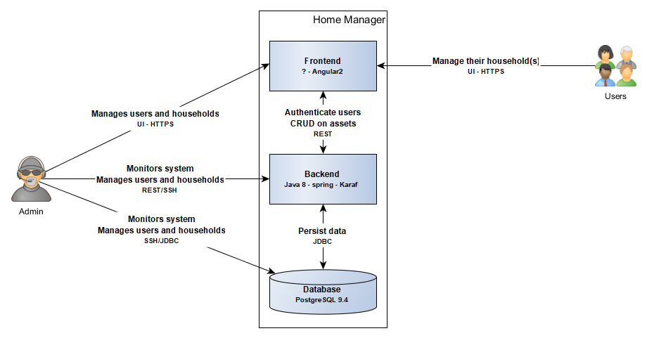
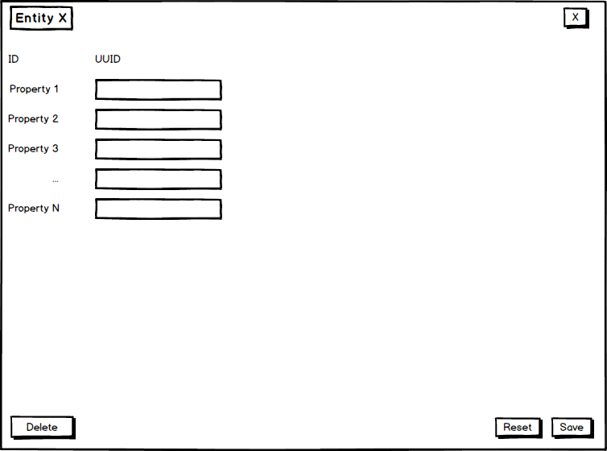
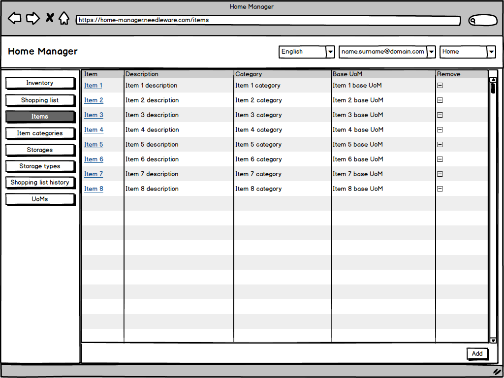
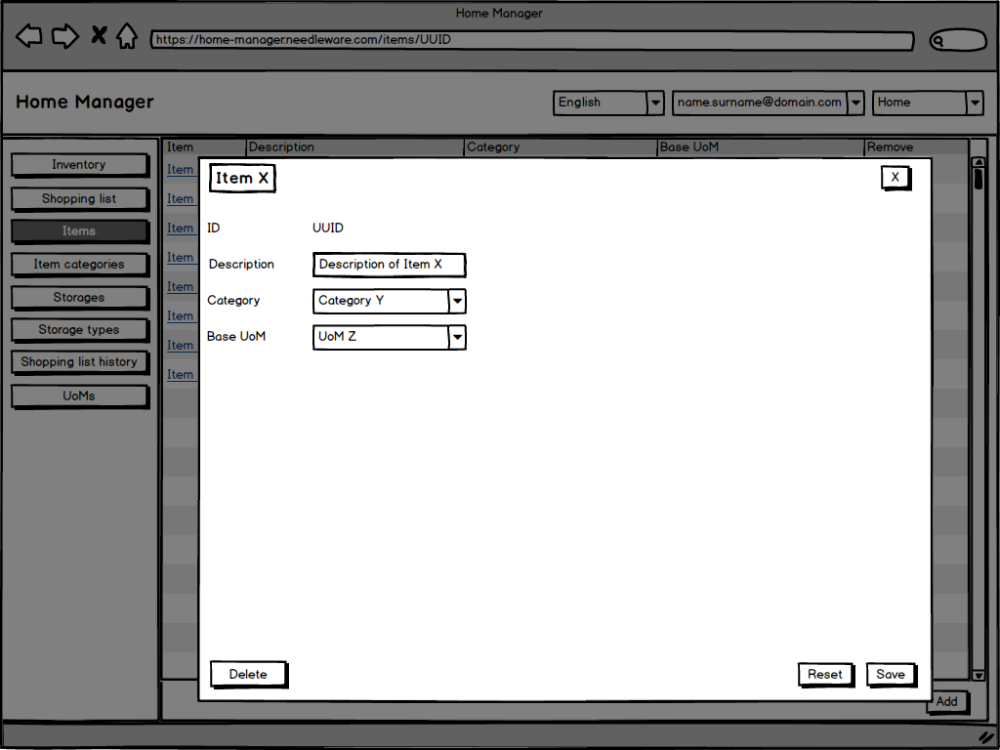
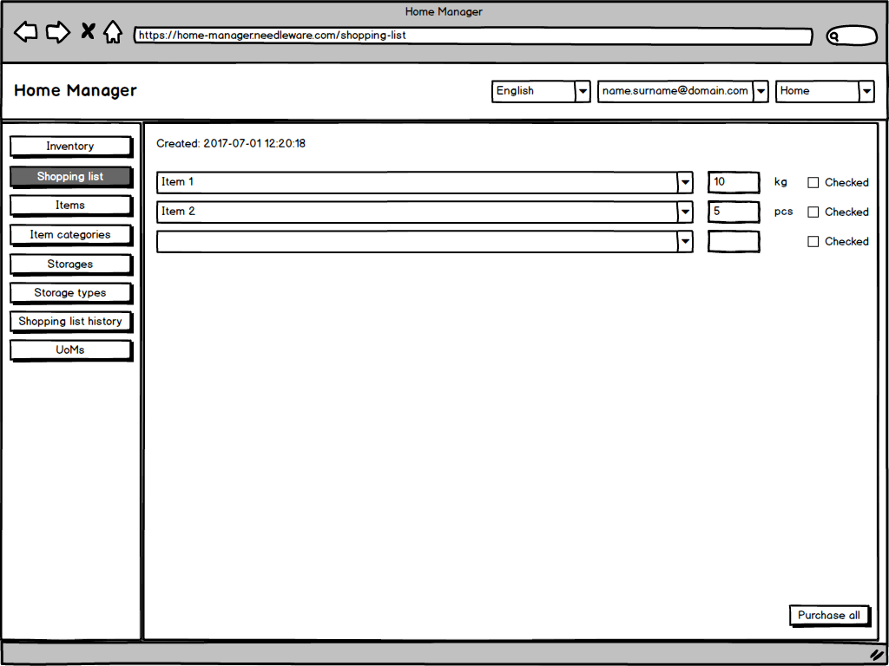

# Home manager
Home manager is a system to keep track of user's house inventory. Basically it is a small warehousing system. It is mainly focused on groceries and other supplies that need to be purchased on regular basis based on their expiration or consumption. The supplies need to be purchased, stored, used and sometimes removed. Also the supplies are often shared among the whole household and not only used by single user. The system should allow parallel operations over the multiple households as well as in the single household. The user interface should be completely web based with optimization for desktop and mobile device. The first prototype should support just two areas of control over the supplies:
* purchase - it should be possible to list multiple items that need to purchased and in what amounts.
* storage - it should be possible to manage items that exist in the system  and in what amounts.
	
## Glossary
* __User__ - any subject that authenticates to the system and is able to call it's functions. In the first prototype version there will be only two user roles - user and admin. User can do anything in the system with exception of managing other users, this functionality should be handled by admin role only.
* __Household__ - a group of users that share the common assets in the system. Each user can be part of multiple households, each household can have multiple users. In the first prototype version, each user can fully mange the households he is assigned to. Household can be created by any user.
* __Item__ - generic item in the system. The items have name, expiration date, base UoM and category.
* __Unit of Measure (UoM)__ - generic unit of measure to describe the amount of each item either stored or to be purchased.
* __Item category__ - items can be grouped into categories, each item can have at most one category.
* __Storage__ - when items exist in the system, it is usefull to know where they are
* __Storage type__ - typical examples can be a fridge, pantry, bathroom rack, etc. For the purpose of extensibility it is worth to allow multiple storages of the same type as each storage can provide different environmental conditions. Also it can happen that single household has multiple fridges, that's why it's usefull to provide a possibility to create for example "Fridge in the kitchen" and "Fridge in the garage". Also in future versions it may be nice to provide a possibility to place an item automatically to it's pre-defined storage type.
* __Shopping list__ - when going shopping it is useful (if not even necessary) to prepare a list of items to be purchased. It is worth to keep a history of shopping lists but only in an archived form.

## User roles
As was mentioned earlier, there are no rights or roles defined for the prototype all users have similar capabilities in the system, the following description of two users serves for more meaningful description of user stories and for possible future extension of the access control system.
* __Adam__ - _User A_ - Typical user of the system. an living in an appartment who wants to have control over the household inventory.
* __Beata__ - _User B_ - Another typical user of the system. Adam's wife who also wants to have control over the common household.
* __Pooka__ - _Admin_ - Administrator of the system.
	
## User stories
User stories are stored as [issues with label user-story](https://github.com/pnidl/home-manager/labels/user-story).

## Quality Attributes (Non-functional requirements)
* __Security__
    * users must be able to access their household data only
    * user data are separated on per-household basis (DB schema based separation is sufficient)
	* OAuth2 authorization framework should be used for user authentication
	* HTTPS should be used
* __Performance__
	* the system should keep the response times for each API call under 2 seconds (TODO: review this)
	* the system should minimize amount API requests - ewbsockets or messaging for UI should be used instead of infinite data refresh loop
* __Stability__
	* the system should not be restarted because of unplanned outages more than once per month
* __Reliability__
	* for the prototype phase no HA is requested 
* __Capacity__
	* each household should be able to keep history of one year of using the system (TODO: analyze the data demands after prototype implementation and testing)
* __Documentation__
	* each component of the system must be specified before implementation
	* the component specification turns into documentation during implemetation
	* the component specifications are part of this Software Guidebook 
	* the Software Guidebook is updated whenever business or technical requirements change
	* user manual is not requested for the prototype
* __Portability__
	* the system must be able to run on Linux and Windows
	* the system must not be dependent on any specific hosting solution
* __Quality__
	* each component in the system has to have reasonable amount of unit tests (TODO: study something about reasonable code coverage)
	* each component in the system has to have an integration test
* __Internationalization__
	* the prototype must provide English and Czech languages only but with possibility to add other languages seamlessly
	* the system must provide a possibility to translate dynamic as well as static texts
* __Backup__
	* there is no backup requested for the prototype
* __Extensibility__
	* the prototype should provide a platform for future extensions like connectivity to some super market APIs, supplies prices, etc.

## Context
There really is not much to say about the context of the simple system as Home manager is in a prototype phase. There is a system and it has it's users and admin. The admin uses UI, REST API and direct SSH access to server to monitor and manage the whole system. Users access the UI to manage and view their household(s).

## Containers
The prototype version of Home Manager uses pretty straightforward three tier architecture. All data are stored in the PostgreSQL database, retrieved, processed and provided via REST API by JEE7 based Backend server and displayed by Angular2 based single-page UI application.

## Components

### Backend

#### Database
To provide real data separation for households, each household should have its own DB schema. In the addition the "Master data" schema needs to be present to store data that need to be accessed globally - for the prototype the Master data schema should contain just Users and Households. All other data are stored in household schemas.

#### Common CRUD service
As the entities managed by the system are very similar in many aspects, a common service to provide basic CRUD operations will help to speed up the development. 
An abstract Entity class should be created that contains following field:
* __id: String__ - ID of the entity, for future extensibility, use String UUIDs for all IDs in the system.

The service should provide following methods:
* __create entity__ - this method will create new entity in the system based on input object, it will create and assign new ID to the entity
* __find entity by ID__ - this method will return the entity identified by given ID
* __list entities__ - this method will list all the entities in the system, it should be parametrized to allow filtering and ordering
* __update entity__ - this method will update the entity in the system according to the given object - the existing entity is fully overwritten with the given one
* __delete entity by ID__ - this method will delete the entity identified by given ID

#### User service
Special implementation of Common CRUD service focused on master data entity User. Its main entity is User class, descendant of Entity class with following additional fields:
* __givenName: String__ - First name of the user
* __surname: String__ - Last name of the user
* __email: String__ - Email address of the user
* __password: String__ - User's current password (TODO: think about best way to store it)
* __laguage: String__ - Preffered language of the user

Additional methods:
* __authenticate user__ - this method will check combination of email address and password to determine whether the user exists in the system and whether the password matches the stored value, it will return the User object if successful, throw AuthenticationException otherwise.
* __is user online__ - this method will check whether the given user is currently online

#### Household service
Special implementation of Common CRUD service focused on master data entity Household. Its main entity is Household class, descendant of Entity class with following additional fields:
* __name: String__ - name of the household - the name shouldn't be unique on the database level, to allow multiple users to create households with same names as other users.
* __schemaName: String__ - name of the database schema where the household data are stored
* __schemaPassword: String__ - password to the database schema of the household (TODO: think about the best way to store it and whether it is really a good approach to to store the information here (maybe an automatically managed Datasource object provided by application server is better?))

#### Household membership service
Special implementation of Common CRUD service focused on master data entity HouseholdMembership. Its main entity is HouseholdMembership class, descendant of Entity class with following additional fields:
* __user: User__ - user who requested to become a member of household
* __household: Household__ - household to become member of
* __status: String__ - status of the membership, can be: REQUESTED, DECLINED, APPROVED

Additional methods:
* __get households for user__ - this method will return list of all households that given user is member of

#### Item service
Special implementation of Common CRUD service focused on household data entity Item. Its main entity is Item class, descendant of Entity class with following additional fields:
* __name: String__ - Name of the item (TODO: think about a best way to localize entity names - create some set of default items and fill it to each household? make item a master data entity?)
* __description: String__ - Description of the item (TODO: think of localization the same way as for name)
* __category: ItemCategory__ - Category that the item is assigned to
* __baseUoM: UoM__ - base unit of measure for the item

Additional methods:
* __get items by category__ - this method will return all items that belond to given category

#### Item category service
Special implementation of Common CRUD service focused on household data entity ItemCategory. Its main entity is ItemCategory class, descendant of Entity class with following additional fields:
* __name: String__ - Name of the item category (TODO: think about a best way to localize entity names - create some set of default item categories and fill it to each household? make item category a master data entity?)
* __description: String__ - Description of the item category (TODO: think of localization the same way as for name)

#### UoM Service
Special implementation of Common CRUD service focused on household data entity UoM. Its main entity is UoM class, descendant of Entity class with following additional fields:
* __name: String__ - Name of the unit (TODO: think about a best way to localize entity names - create some set of default items and fill it to each household? make item a master data entity?)
* __abbreviation: String__ - common abbreviation of the unit (TODO: think of localization the same way as for name)
* __base: UoM__ - base unit for current unit or null if it's a base unit itself
* __ratioToBase: double__ - ratio to convert the unit to the base unit, or null if it's a base unit itself

Additional methods:
* __convert amount__ - this method converts given amount from one unit to another, only works for units that share the same base unit, otherwise an IllegalArgumentException is thrown

#### Storage service
Special implementation of Common CRUD service focused on household data entity Storage. Its main entity is Storage class, descendant of Entity class with following additional fields:
* __name: String__ - Name of the storage (TODO: think about a best way to localize entity names)
* __description: String__ - Description of the item (TODO: think of localization the same way as for name)
* __type: StorageType__ - Type of the storage

Additional methods:
* __get storages by type__ - this method will return all items that belond to given category

#### Storage item service
Special implementation of Common CRUD service focused on household data entity StorageItem. Its main entity is StorageItem class, descendant of Entity class with following additional fields:
* __item: Item__ - reference to item stored
* __uom: UoM__ - unit of measure used for measuring the stored amount
* __amount: double__ - stored amount of item
* __storage: Storage__ - the storage where the item is stored

Additional methods:
* __add item to storage__ - adds given amount of given item into the given storage
* __remove item from storage__ - removes given amount of given item from the given storage
* __list stored items__ - returns the invetory based on provided filter

#### Storage type service
Special implementation of Common CRUD service focused on household data entity StorageType. Its main entity is StorageType class, descendant of Entity class with following additional fields:
* __name: String__ - Name of the storage type (TODO: think about a best way to localize entity names - create some set of default storage types and fill it to each household? make storage a master data entity?)
* __description: String__ - Description of the storage type (TODO: think of localization the same way as for name)

#### Shopping list service
Special implementation of Common CRUD service focused on household data entity ShoppingList. Its main entity is ShoppingList class, descendant of Entity class with following additional fields:
* __created: Date__ - date when the shopping list was open
* __closed: Date__ - date when the shopping list was closed (or null if still open)
* __items: List<ShoppingItem>__ - list of ShoppingItems currently present in the shopping list

Additional methods:
* __get open shopping list__ - return currently open shopping list

#### Shopping item service
Special implementation of Common CRUD service focused on household data entity ShoppingItem. Its main entity is ShoppingItem class, descendant of Entity class with following additional fields:
* __item: Item__ - reference to item to be shopped
* __uom: UoM__ - unit of measure used for measuring the wanted amount
* __amount: double__ - wanted amount of item
* __shoppingList: ShoppingList__ - the shopping list where the item is mentioned

Additional methods:
* __add item to list__ - adds given amount of given item into the given shopping list
* __remove item from list__ - removes given amount of given item from the given shopping list

### Frontend

#### Default page
Default page will be shown to unauthenticated users. It will allow users to login and/or register new account. It will communicate with [User service](#user-service).

* __URL__ - https://home-manager.needleware.com/

#### Top menu component
All pages except the default page will dispaly a top menu. It will show:
* Home manager logo
* drop-down menu language selection
* drop-down menu with user's email address and logout button
* drop-down menu to select current household and add new one

#### Navigation menu component
All pages except the default page will dispaly a navigation menu. It will show list of links/buttons to navigate to all listings in the system.

#### Common list component
It is usefull to prepare a common component that will display system entities and their interesting properties in a table. Each row should dispaly information about a single entity and by clicking the row, it should display the detail component for the entity in a hover window.
The component will provide:
* table header - dynamically defined eccording to displayed entity. Filtering and sorting is not a part of the prototype, but the component should be extendable as this functionality will have a high priority in future releases.
* internal scrolling (only the table values are scrolled)
* table of values - each entity name will open a detail window, each line will have a "Remove" column on the last position to remove the entity
* Add button - on click it will display a Create hover window

#### Common detail component
Same as common listing, it will be useful to provide a generic component for displaying details about entities in the system. The component should be shown as a hove window over the listing and should display all properties of selected component. In the addition it should show an "Edit" button that will switch the component to Common edit component and a "dismiss" button as a cross in top-right corner.

#### Common edit/create component
The same as Common detail component but all entity properties (including name but excluding ID) are displayed as editable text inputs. It provides two buttons:
* __Save__ - will update the system entity to current state of the edit component
* __Reset__ - will reset all local changes to the values saved in the system

#### Household creation page
Selecting the "Add new" option from Top menu's Household selection will open a Common create component for households.

#### Items page
Clicking the "Items" navigation button from Navigation menu will show Common listing component for items. This page should serve as an example for all other listing/edit/create pages in the system.

#### Shopping list page
Clicking the "Shopping List" navigation button from Navigation menu will show Shopping list page. This page will show the date and when the shopping list was open and list of entered items, their amounts, UoMs and a check box to mark the item as checked.
Whenever an item is added to the list, new line for next item appears.
In the addition there is a button to purchase all items, close shopping list and move all unchecked items to the new shopping list.

